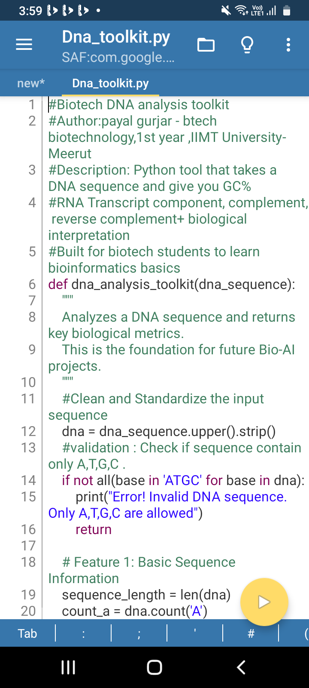
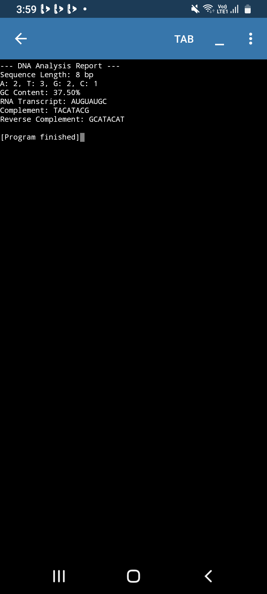

<h1 align="center">Hi 👋, I'm Payal Gurjar</h1>
<h3 align="center">BTech Biotech Student @ IIMT University, Meerut</h3>

- 🔬 **Currently studying:** Biotechnology at IIMT Meerut  
- 🌱 **Learning:** Git, GitHub, Python basics & Bioinformatics  
- 💡 **Interested in:** Merging Biology with Technology  
- ⚡ **Fun fact:** From Meerut, Uttar Pradesh

---

 
  <i>Turning DNA into Data 🧬💻</i> 

## 🧬 My First Bioinformatics Project: DNA Toolkit

A Python tool that analyzes DNA sequences with functions for:
- ✅ GC Content calculation 
- ✅ DNA to RNA Transcription
- ✅ DNA Complement & Reverse Complement

### 📸 Live Demo

**Code:**

**Output:**

### 🚀 Try It Yourself
Check out the code: [Dna_toolkit.py](Dna_toolkit.py)

---
*Biology + Code = Future* 💚 *BTech Biotech @ IIMT University, Meerut*

